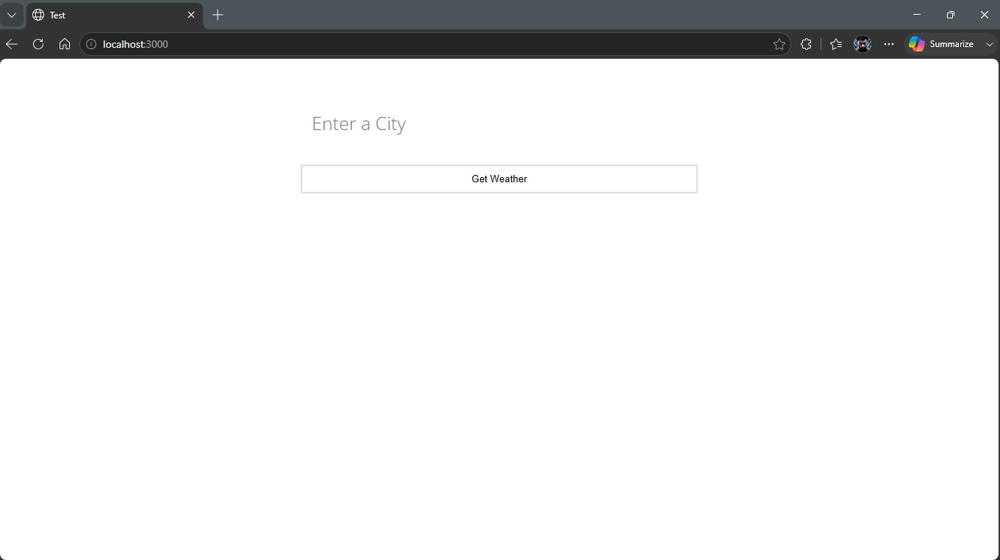

# Weather App (Dockerized)

This project is a Dockerized version of the original Simple Node.js Weather App.

## About

This project was completed as part of my DevOps training to learn how to containerize an existing Node.js application using Docker.

The focus of this project was:
- Writing a Dockerfile
- Using a .dockerignore file
- Building a Docker image
- Running a Docker container
- Publishing the Dockerized project to GitHub

## Technologies

- Node.js
- Express.js
- Docker

## Project Structure

```
.
├── Dockerfile
├── .dockerignore
├── package.json
├── package-lock.json
├── server.js
├── public/
└── views/
```

## Build the Image

```bash
docker build -t weather-app:v1 .
```

## Run the Container

```bash
docker run -d -p 3000:3000 --name weather-container weather-app:v1
```

## Access the Application

Open your browser and visit:

```
http://localhost:3000
```

## Docker Concepts Practiced

- Base Image
- Working Directory
- Docker Layer Caching
- COPY Instruction
- npm ci
- Non-root User
- EXPOSE
- CMD
- .dockerignore

## Note

The application starts successfully inside Docker.

## Screenshot


The weather search functionality may not work because the original application depends on an outdated weather API.

## Original Project

Original repository:
https://github.com/bmorelli25/simple-nodejs-weather-app